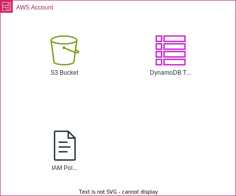

# Terraform AWS tfstate S3 Backend

This terraform module create Terraform Backend using Amazon S3 to store tfstate.

## Resource Overview




## How To Use

```sh
terraform init
terraform plan
terraform apply
```

## How To Develop

### Prerequisite

- tenv
- terraform
- TFLing
- Trivy
- checkov
- terraform-docs
- pre-commit-terraform

### Commands

```sh
terraform fmt
terraform init
terraform validate
terraform tflint
terraform trivy
terraform checkov
terraform test
terraform plan
terraform-docs
pre-commit-terraform
terraform
```

```sh
terraform-docs markdown table --output-file README.md --output-mode inject .
```

```sh
pre-commit run -a
```


### Test

- [Tests - Configuration Language | Terraform | HashiCorp Developer](https://developer.hashicorp.com/terraform/language/tests)
- [Write Terraform Tests | Terraform | HashiCorp Developer](https://developer.hashicorp.com/terraform/tutorials/configuration-language/test)
- [Testing HashiCorp Terraform](https://www.hashicorp.com/ja/blog/testing-hashicorp-terraform)
- [Terraformテスト入門 - Speaker Deck](https://speakerdeck.com/msato/terraform-test)


### Naming Rule

- terraform
- aws


<!-- BEGIN_TF_DOCS -->
## Requirements

| Name | Version |
|------|---------|
| <a name="requirement_terraform"></a> [terraform](#requirement\_terraform) | >= 1.0 |
| <a name="requirement_aws"></a> [aws](#requirement\_aws) | >= 5.83 |

## Providers

| Name | Version |
|------|---------|
| <a name="provider_aws"></a> [aws](#provider\_aws) | 5.89.0 |

## Modules

| Name | Source | Version |
|------|--------|---------|
| <a name="module_s3"></a> [s3](#module\_s3) | ./modules/s3-bucket | n/a |
| <a name="module_iam_policy"></a> [iam\_policy](#module\_iam\_policy) | ./modules/iam-policy | n/a |

## Resources

| Name | Type |
|------|------|
| [aws_dynamodb_table.this](https://registry.terraform.io/providers/hashicorp/aws/latest/docs/resources/dynamodb_table) | resource |

## Inputs

| Name | Description | Type | Default | Required |
|------|-------------|------|---------|:--------:|
| <a name="input_env"></a> [env](#input\_env) | The environment to create resources in | `string` | n/a | yes |
| <a name="input_product"></a> [product](#input\_product) | The product to create resources for | `string` | n/a | yes |
| <a name="input_usage"></a> [usage](#input\_usage) | The usage to create resources for | `string` | `"tfstate"` | no |
| <a name="input_region"></a> [region](#input\_region) | The region to create resources in | `string` | n/a | yes |
| <a name="input_suffix"></a> [suffix](#input\_suffix) | The suffix to append to S3 Bucket | `string` | n/a | yes |
| <a name="input_tfstate_lock_type"></a> [tfstate\_lock\_type](#input\_tfstate\_lock\_type) | The type of lock to use for the state file (None, DynamoDB, S3) | `string` | `"None"` | no |
| <a name="input_tags"></a> [tags](#input\_tags) | n/a | `map(string)` | `{}` | no |
| <a name="input_enable_force_destroy"></a> [enable\_force\_destroy](#input\_enable\_force\_destroy) | n/a | `bool` | `false` | no |
| <a name="input_enable_object_lock"></a> [enable\_object\_lock](#input\_enable\_object\_lock) | n/a | `bool` | `false` | no |
| <a name="input_sse_algorithm"></a> [sse\_algorithm](#input\_sse\_algorithm) | n/a | `string` | `"AES256"` | no |
| <a name="input_enable_sse_bucket_key"></a> [enable\_sse\_bucket\_key](#input\_enable\_sse\_bucket\_key) | n/a | `bool` | `false` | no |
| <a name="input_kms_master_key_id"></a> [kms\_master\_key\_id](#input\_kms\_master\_key\_id) | n/a | `string` | `null` | no |
| <a name="input_enable_inteligent_tiering"></a> [enable\_inteligent\_tiering](#input\_enable\_inteligent\_tiering) | n/a | `string` | `"Enabled"` | no |
| <a name="input_tiering_level"></a> [tiering\_level](#input\_tiering\_level) | n/a | `string` | `"Basic"` | no |
| <a name="input_logging_target_bucket"></a> [logging\_target\_bucket](#input\_logging\_target\_bucket) | n/a | `string` | `null` | no |
| <a name="input_logging_target_prefix"></a> [logging\_target\_prefix](#input\_logging\_target\_prefix) | n/a | `string` | `null` | no |
| <a name="input_dynamodb_table_name"></a> [dynamodb\_table\_name](#input\_dynamodb\_table\_name) | n/a | `string` | `null` | no |
| <a name="input_iam_policy_name"></a> [iam\_policy\_name](#input\_iam\_policy\_name) | n/a | `string` | `null` | no |

## Outputs

| Name | Description |
|------|-------------|
| <a name="output_s3"></a> [s3](#output\_s3) | output of s3 bucket |
| <a name="output_dynamodb"></a> [dynamodb](#output\_dynamodb) | output of dynamodb |
| <a name="output_iam"></a> [iam](#output\_iam) | output of iam policy |
<!-- END_TF_DOCS -->
